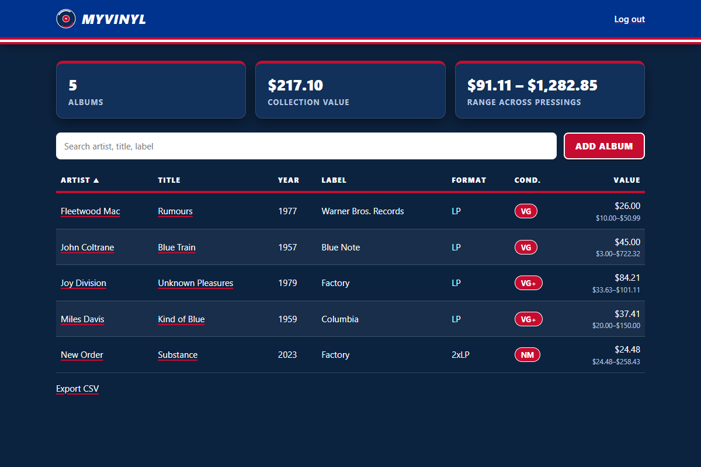
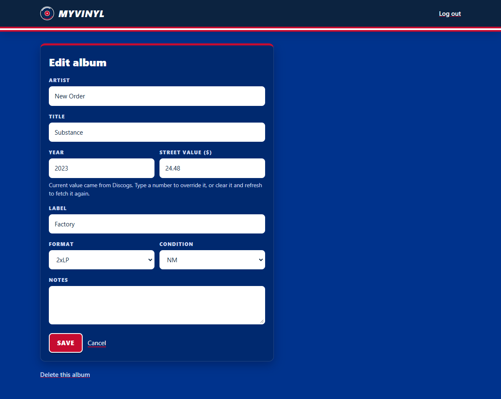

<p align="center">
  
</p>

<h1 align="center">myvinyl</h1>

<p align="center">
  A self-hosted inventory for your vinyl record collection, with automatic street values,
  price ranges, and release details from Discogs.
</p>


---

## Contents

- [Features](#features)
- [Screenshots](#screenshots)
- [Quick start](#quick-start)
- [Configuration](#configuration)
- [Getting a Discogs token](#getting-a-discogs-token)
- [How valuation works](#how-valuation-works)
- [Using the app](#using-the-app)
- [Security](#security)
- [Deploying online](#deploying-online)
- [Backups and data](#backups-and-data)
- [Development](#development)
- [Project layout](#project-layout)
- [Changelog](#changelog)

---

## Features

### Collection
- **Albums:** artist, title, year, label, format (LP, 2xLP, EP, 7", 10", 12" single,
  box set), condition on the Goldmine scale (M, NM, VG+, VG, G+, G, F, P), notes, and
  street value.
- **Search** by artist, title, or label, and **sort** by any column. Condition sorts by
  grade, not alphabetically.
- **Totals** at the top of the page: album count, collection value, and the collection's
  total low-to-high range.
- **CSV export** of every album with value, range, value source, and Discogs release ID.
  Cells are protected against spreadsheet formula injection.

### Discogs integration
- **Automatic value lookup.** Leave the value blank when you add an album and myvinyl fills
  it in from the Discogs marketplace.
- **Value range across pressings.** Up to 10 matching vinyl pressings are priced, and the
  low, median, and high asking prices are recorded along with each pressing's price and
  number of copies for sale.
- **Release details.** The full Discogs release record is stored: release date, country,
  label and catalog number, format details, genres, styles, barcode, matrix/runout
  identifiers, tracklist, credits, community have/want counts and rating, and release notes.
- **Fills in what you left blank.** An empty label or year is filled from Discogs. Anything
  you typed is never overwritten.
- **Album art chooser.** Every image on the release (front, back, labels, inserts) is kept,
  and you pick which one to display.
- **Background lookups.** Saving is instant; the album page shows progress and refreshes
  itself until the lookup is done. Requests are throttled to stay within Discogs' rate limits.
- **Pick your pressing.** Click **Mine** on the right row of the pressings table and the
  value, details, and art follow your copy from then on.
- **Add by barcode or catalog number** for an exact match; if several pressings share a
  barcode, you choose one.
- **Import your Discogs collection** (token required), including your Discogs ratings.
- **Value history.** Prices are re-checked about once a week, and the album page charts
  value and range over time.
- **Optional token** for a faster API rate limit.

### Ratings and reviews
- Rate albums from half a star to 5 stars and write a review.
- Rate each track and add a short note.
- Sort the collection by rating.

### Look and feel
- Buffalo Bills colors: royal blue pages (navy in dark mode), a navy header with a
  red-white-red stripe, red and white buttons, and white inputs.
- Server-rendered pages with **no JavaScript**. Works on phones, with tables that scroll
  horizontally.
- Times shown in US Eastern time (EST/EDT).

---

## Screenshots

| Collection (light) | Collection (dark mode) |
|---|---|
|  |  |

**Album page:** value, range across pressings, community stats, album art chooser, Discogs
details, pressings checked, tracklist, credits, and release notes.


| Edit album | Log in | Phone |
|---|---|---|
|  |  |  |

A dark-mode album page is in [docs/screenshots/album-dark.png](docs/screenshots/album-dark.png).

---

## Quick start

Requirements: Python 3.12 or newer and [uv](https://docs.astral.sh/uv/).

```powershell
git clone <your-repo-url> myvinyl
cd myvinyl
uv sync
```

**1. Create your login.** This prompts for a password (12+ characters, not echoed) and
prints the two values to set:

```powershell
uv run python -m myvinyl.credentials
```

**2. Set the values and start the server.** In PowerShell, use single quotes: the
password hash contains `$` characters.

```powershell
$env:MYVINYL_SECRET_KEY    = '<printed value>'
$env:MYVINYL_PASSWORD_HASH = '<printed value>'
$env:MYVINYL_DISCOGS_TOKEN = '<your token>'    # optional, see below
uv run myvinyl
```

On macOS or Linux:

```bash
export MYVINYL_SECRET_KEY='<printed value>'
export MYVINYL_PASSWORD_HASH='<printed value>'
export MYVINYL_DISCOGS_TOKEN='<your token>'    # optional
uv run myvinyl
```

**3. Open** <http://127.0.0.1:8000> and log in.

`uv run myvinyl --host 0.0.0.0 --port 9000` changes the address. Read
[Deploying online](#deploying-online) before listening on anything other than localhost.

---

## Configuration

All settings are environment variables. The app **refuses to start** if a required value
is missing or malformed, rather than running with weak defaults.

| Variable | Required | Purpose |
|---|---|---|
| `MYVINYL_SECRET_KEY` | Yes | Signs the session cookie. 32+ characters; `myvinyl.credentials` generates one. |
| `MYVINYL_PASSWORD_HASH` | Yes | Argon2id hash of your login password, from `myvinyl.credentials`. |
| `MYVINYL_DISCOGS_TOKEN` | No | Discogs personal access token. Raises the API limit from 25 to 60 requests per minute. |
| `MYVINYL_DB` | No | Path to the SQLite database file. Default: `myvinyl.db` in the current directory. |
| `MYVINYL_REFRESH_DAYS` | No | Re-check prices of albums older than this many days. Default `7`; `0` turns automatic refresh off. |

Keep these out of version control. `.gitignore` already excludes `.env` files and
databases. A password manager or secret manager is a better home for them than a
plain-text file.

---

## Getting a Discogs token

myvinyl works without a token. With one, the Discogs API allows 60 requests per minute
instead of 25, so lookups finish about twice as fast: about 12 seconds per album instead
of about 30.

1. **Create a free Discogs account** at <https://www.discogs.com/users/create>, or log in
   if you already have one.
2. **Open the developer settings:** click your avatar (top right), choose **Settings**, then
   **Developers**. The direct link is <https://www.discogs.com/settings/developers>.
3. **Click "Generate new token."** Discogs shows a personal access token: a long string of
   letters and numbers.
4. **Copy the token** and set it as `MYVINYL_DISCOGS_TOKEN` (see
   [Quick start](#quick-start)), then restart myvinyl.

Notes:

- **Treat the token like a password.** It is tied to your Discogs account. myvinyl only
  sends it to `api.discogs.com` in the `Authorization` header, and never logs or displays it.
- **To revoke it**, return to the same Developers page and generate a new token. That
  invalidates the old one.
- **myvinyl only reads public data** (search, marketplace statistics, and release records),
  so you don't need to set up a seller account or OAuth.
- Use of the API is governed by the
  [Discogs API Terms of Use](https://support.discogs.com/hc/en-us/articles/360009334593-API-Terms-of-Use).
  See also the [Discogs API documentation](https://www.discogs.com/developers).

---

## How valuation works

When you save an album, myvinyl runs a lookup in the background:

1. **Search.** It queries Discogs for vinyl releases using the artist and title as separate
   fields. Free-text search can return unrelated records, so it isn't used. Results whose
   title doesn't contain your album title are discarded.
2. **Rank.** Official pressings come before unofficial ones, then pressings from the year
   closest to the one you entered. Ties keep Discogs' relevance order.
3. **Price.** It fetches the marketplace statistics for the top 10 pressings: the lowest
   current asking price (USD) and the number of copies for sale.
4. **Choose.** The top-ranked pressing is the **best match**. Its full release record and
   images are saved.
5. **Record.**

| Stored | Meaning |
|---|---|
| **Value** | The best match's lowest asking price. If that pressing has none for sale, the median of the range is used. A value you typed yourself is never replaced. |
| **Range** | The lowest and highest asking prices across the pressings checked, plus the median. |
| **Pressings** | Every pressing checked, with year, country, label, catalog number, format, copies for sale, and price. |

**Things to know**

- The match is **automatic** and can be a different pressing than the one you own. The
  album page marks the best match and links each pressing to Discogs so you can check.
- An **asking price** is what sellers want today, for a copy in any condition. It isn't
  a sale price or an appraisal, and it isn't adjusted for your copy's grade.
- A lookup makes about 12 API calls. Without a token that takes about 30 seconds; extra
  lookups queue behind it.
- Click **Refresh from Discogs** on any album to rerun its lookup with current prices.

---

## Using the app

| Task | How |
|---|---|
| Add an album | **Add album**, fill in artist, title, format, and condition. Leave value blank to have it looked up. |
| See details | Click the artist or title in the collection. |
| Override the value | **Edit**, type a value, **Save**. Refreshes keep your value. |
| Go back to the Discogs value | **Edit**, clear the value, **Save**, then **Refresh from Discogs**. |
| Change the displayed cover | On the album page, click a different image under **Album art**. |
| Fix the pressing | On the album page, click **Mine** on your row of **Pressings checked**. |
| Add by barcode | Type the barcode or catalog number at the top of **Add album**; artist and title can stay blank. |
| Import from Discogs | **Import** next to **Add album**, choose a default condition, **Import my collection**. |
| Rate and review | **Your rating and review** on the album page; **Rate tracks** above the tracklist. |
| Re-check prices | **Refresh from Discogs** on the album page. |
| Export | **Export CSV** under the collection table. |
| Delete | **Edit**, then **Delete this album**. |

**Lookup status messages** on the album page:

- **Looking up**: in progress; the page refreshes every 5 seconds.
- **No matching vinyl release**: check the spelling of the artist and title, then refresh.
- **Did not finish**: a network error, a rate limit, or a server restart cut it off. Refresh to retry.

---

## Security

myvinyl is a single-user app, but it is built to be safe on the internet.

| Area | Protection |
|---|---|
| Login | One password, stored only as an **Argon2id** hash. 5 failed attempts within 15 minutes from one IP blocks further attempts from it. |
| Sessions | Signed cookie, `HttpOnly`, `Secure`, `SameSite=Lax`, 12-hour lifetime. Logging in starts a fresh session. |
| CSRF | Every form that changes data carries a per-session token, compared in constant time. |
| Database | All SQL is parameterized. Sorting uses a fixed allowlist of columns. Search treats `%` and `_` as plain characters. |
| Output | Jinja2 auto-escaping on all pages, including text that comes from Discogs. |
| Headers | Strict Content Security Policy (no scripts at all; images only from this site and `i.discogs.com`), `X-Frame-Options: DENY`, `nosniff`, `no-store`. |
| Discogs | Requests only go to `api.discogs.com` over HTTPS, with timeouts and a response size cap. Every response is type-checked. Only images on `i.discogs.com` are displayed, and a cover can only be one of the release's own images. |
| Input | Length limits, a year between 1900 and next year, allowed formats and conditions only, values between 0 and 1,000,000 with up to two decimal places. Invalid input is rejected, not quietly fixed. |
| Secrets | Required settings fail closed. Secrets are kept out of logs and error output. |
| CSV | Cells starting with `=`, `+`, `-`, or `@` are prefixed so spreadsheets don't execute them. |

---

## Deploying online

The server listens only on `127.0.0.1` by default. To reach it from elsewhere, choose one
of these:

- **A private network** such as [Tailscale](https://tailscale.com/). Only your own devices
  can reach the app, and nothing is exposed to the public internet.
- **A reverse proxy that handles HTTPS**, such as [Caddy](https://caddyserver.com/), which
  gets certificates automatically:

  ```
  vinyl.example.com {
      reverse_proxy 127.0.0.1:8000
  }
  ```

Notes:

- The session cookie is marked `Secure`, so login only works over HTTPS (or on `localhost`).
- Login rate limiting is per client IP. uvicorn trusts `X-Forwarded-For` only from
  `127.0.0.1`, so a proxy on the same machine works as-is. For a proxy on another host, set
  `FORWARDED_ALLOW_IPS=<proxy-ip>`; otherwise all clients share one limit.
- Run the app as an ordinary user, never as root or Administrator.

---

## Backups and data

- Everything lives in one SQLite file (`MYVINYL_DB`, default `myvinyl.db`). Stop the
  server and copy that file to back it up.
- **Export CSV** gives you a spreadsheet-friendly copy of your albums and values.
- Discogs data is kept in two tables: `discogs_releases` holds the raw release JSON for
  each album, and `discogs_pressings` holds the pressings checked with their prices.
- New versions upgrade the database automatically on startup, without deleting anything.

---

## Development

```powershell
uv sync                                        # install, including dev tools
uv run pytest                                  # 52 tests; Discogs is faked, no network needed
uv run ruff check --fix . ; uv run ruff format .
```

Discogs access can be swapped out: `create_app(settings, service=..., inline_jobs=True)`
takes any object with the `DiscogsService` methods and runs background jobs inline. The
tests use this, so they never call the real API or start threads.

---

## Project layout

```
myvinyl/
├── src/myvinyl/
│   ├── main.py          # FastAPI app: routes, security headers, CSRF, background lookups
│   ├── discogs.py       # Discogs client (throttle, retries), matching, pricing, import
│   ├── lookups.py       # Background lookup worker and weekly refresh scheduler
│   ├── charts.py        # Server-side SVG geometry for the value-history chart
│   ├── db.py            # SQLite schema, migrations, parameterized queries
│   ├── albums.py        # Album fields and form validation
│   ├── auth.py          # Argon2id verification and login rate limiter
│   ├── config.py        # Environment settings (fail closed)
│   ├── credentials.py   # Password hash and secret key generator
│   ├── __main__.py      # `uv run myvinyl` entry point
│   ├── templates/       # Jinja2 pages: collection, album, form, login
│   └── static/          # style.css, logo.svg, favicons
├── tests/               # pytest suite
├── docs/screenshots/    # Images used in this README
├── CHANGELOG.md
└── pyproject.toml
```

---

## Changelog

The full history is in [CHANGELOG.md](CHANGELOG.md).

### 0.5.0 - 2026-10-09
- **Added:** pick your pressing; add by barcode or catalog number; Discogs collection
  import; value history chart with weekly automatic refresh; album and track ratings and
  reviews.
- **Changed:** lookups share one background worker.

### 0.4.0 - 2026-10-09
- **Added:** value range across up to 10 pressings (low, median, high, and per-pressing
  prices); full Discogs release metadata on a new album page; blank label and year filled
  from Discogs; album art chooser; optional Discogs token; logo and favicon; range columns
  in the CSV export.
- **Changed:** lookups run in the background with throttling and retry; typed values
  survive refreshes; a stronger Bills theme (blue pages, red and white controls);
  times shown in Eastern time.
- **Fixed:** pressing labels no longer include every company credit.

### 0.3.0 - 2026-10-09
- Automatic street value from the best-matching Discogs pressing, and a "Look up value"
  button.

### 0.2.0 - 2026-10-09
- Buffalo Bills color theme.

### 0.1.0 - 2026-10-09
- First release: albums with search, sort, totals, and CSV export; Argon2id login with rate
  limiting and CSRF protection.

---

<sub>myvinyl is a personal project and is not affiliated with Discogs or the Buffalo Bills.
Album data and images come from <a href="https://www.discogs.com">Discogs</a>.</sub>
