<p align="center">
  
</p>

<h1 align="center">myvinyl</h1>

<p align="center">
  A self-hosted, multi-user inventory for vinyl record collections, with automatic street
  values, price ranges and history, release details, and album art from Discogs.
</p>

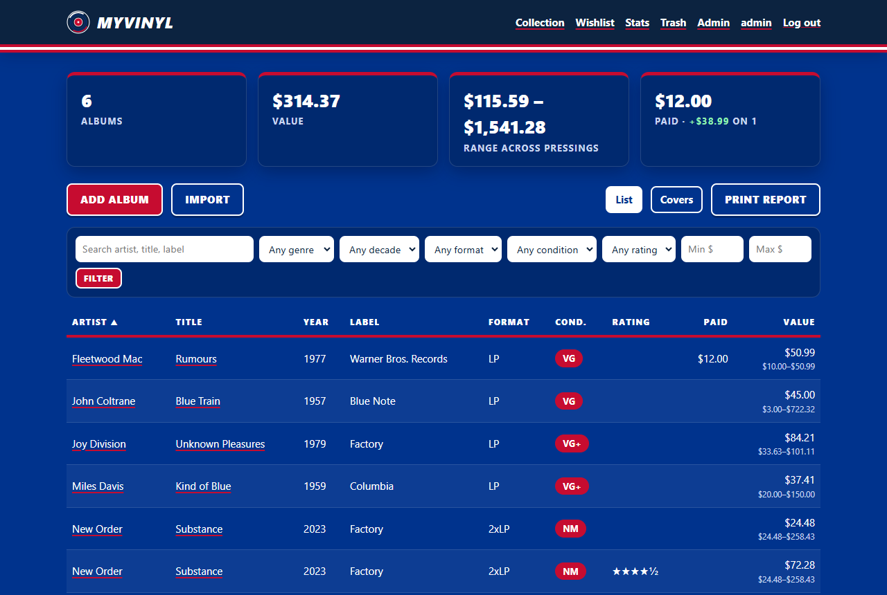

---

## Contents

- [Features](#features)
- [Screenshots](#screenshots)
- [Quick start](#quick-start)
- [Configuration](#configuration)
- [Getting a Discogs token](#getting-a-discogs-token)
- [Accounts and admins](#accounts-and-admins)
- [How valuation works](#how-valuation-works)
- [Using the app](#using-the-app)
- [Security](#security)
- [Deploying online](#deploying-online)
- [Backups and data](#backups-and-data)
- [Development](#development)
- [Project layout](#project-layout)
- [Changelog](#changelog)

---

## Features

### Collection
- **Albums:** artist, title, year, label, format (LP, 2xLP, EP, 7", 10", 12" single,
  box set), condition on the Goldmine scale (M through P), street value, purchase price,
  date and place bought, and notes.
- **Add by barcode or catalog number** for an exact Discogs match. If several pressings
  share a barcode (for example black and colored vinyl), you choose one.
- **Import your Discogs collection** (and Discogs star ratings) in one step.
- **List or cover-grid view**, sortable by any column.
- **Filters:** search text, genre or style, decade, format, condition, minimum rating, and
  value range. Totals, stats, CSV export, and printed reports all follow the filters.
- **Totals:** album count, value, range across pressings, amount paid, and gain or loss.
- **Dated notes:** a journal per album for cleanings, plays, provenance, or anything else.
- **Trash:** deleted albums can be restored for 30 days, then they are removed for good.

### Discogs integration
- **Automatic value lookup:** leave the value blank and myvinyl fills it in from the
  Discogs marketplace.
- **Pick your pressing:** a **Mine** button on the album's pressing list pins your exact
  copy; the value, details, and art follow it from then on.
- **Value range across pressings:** up to 10 matching pressings are priced, with the low,
  median, and high recorded.
- **Value history:** every lookup is recorded and charted. Prices are re-checked about
  once a week, automatically.
- **Release details:** release date, country, label and catalog number, format details,
  genres, styles, barcodes, matrix/runout identifiers, tracklist, credits, community
  have/want counts and rating, and release notes.
- **Album art:** every image on the release is kept; choose the one to display. The chosen
  cover is saved locally so it keeps working even if Discogs changes its links.
- **Fills in what you left blank:** an empty label or year comes from Discogs; anything
  you typed is never overwritten.

### Ratings and reviews
- Rate albums from half a star to 5 stars and write a review.
- Rate each track and add a short note.

### Wishlist
- Track records you want, with a target price and the current lowest Discogs price.
  Records at or below your target are highlighted.
- Import your Discogs wantlist.
- **Got it** moves a record into your collection with the date and price you paid.

### Stats and reports
- **Stats page:** counts and value by genre, decade, format, condition, label, and your
  ratings, plus the most valuable records.
- **Printed reports** of any filtered view, with cover thumbnails and totals. Print or
  save as PDF from the browser; the print layout is black on white.
- **CSV export** of any filtered view.

### People
- **Multiple users,** each with a private collection, wishlist, and stats.
- **Admins** can view and change any collection, invite people, reset passwords, and
  disable accounts.
- **Invite links:** one-time, expire after 7 days; there is no open sign-up.
- **Profiles:** display name, about text, Discogs username (pre-fills imports), and theme.

### Themes
Five themes in Buffalo Bills colors, chosen per user: **Royal blue**, **Navy**,
**Light** (mostly white), **Gray** (light gray), and **Automatic** (royal by day, navy
when the system is in dark mode).

### Operations
- Daily automatic backups (14 kept), plus **Back up now** on the admin page.
- Docker image and compose file for deploying behind Caddy.
- No JavaScript: server-rendered pages under a strict Content Security Policy.
- Times shown in US Eastern time.

---

## Screenshots

| Collection (Royal) | Cover grid |
|---|---|
|  | 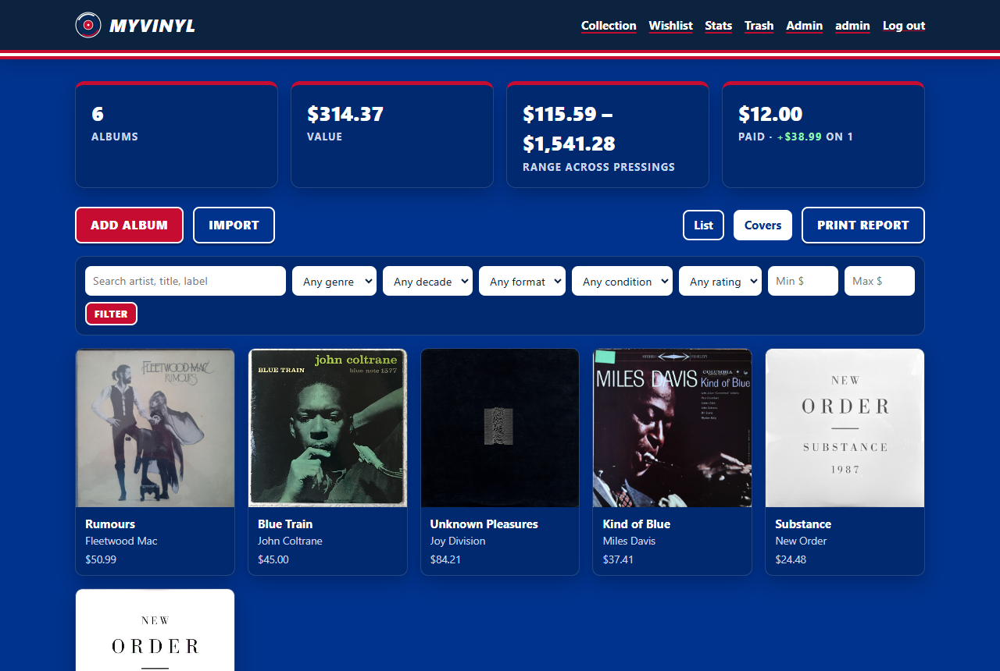 |

| Light theme | Gray theme | Navy theme |
|---|---|---|
| 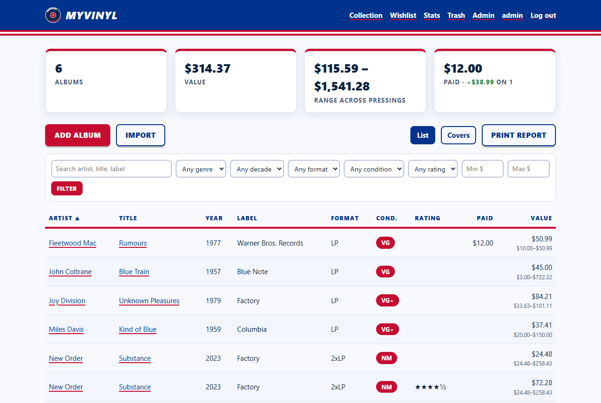 | 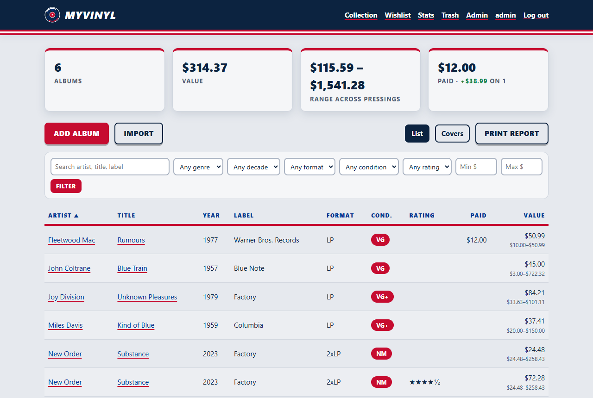 | 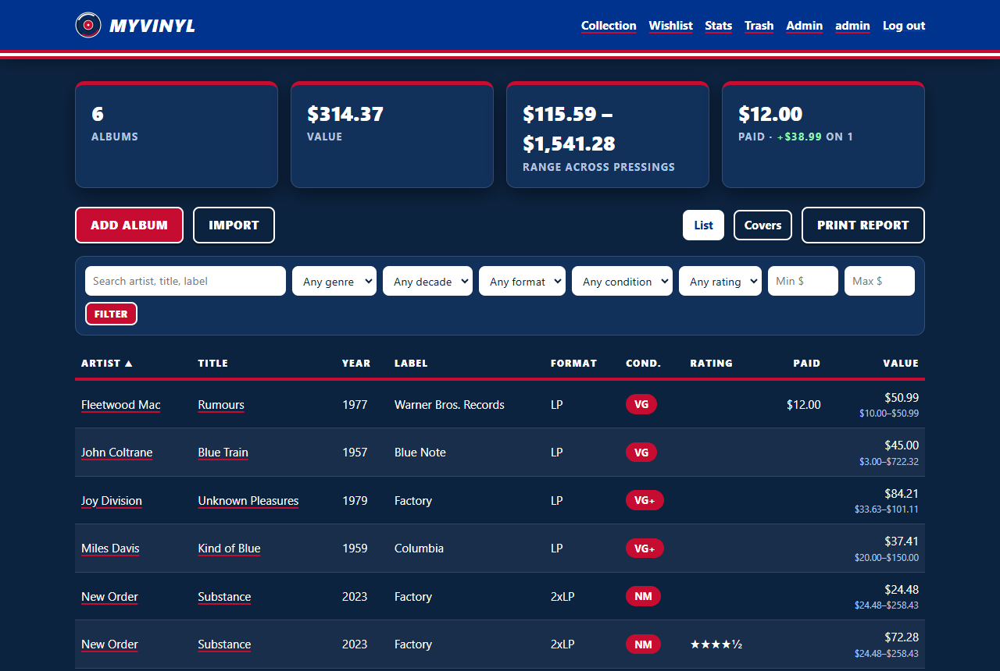 |

**Album page:** street value, range across pressings, community stats, purchase and gain,
value history chart, rating and review, album art chooser, dated notes, Discogs details,
pressings with **Mine** buttons, tracklist with your track ratings, credits, and notes.

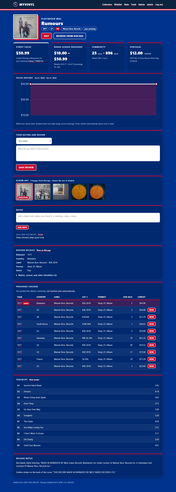

| Stats | Printed report |
|---|---|
| 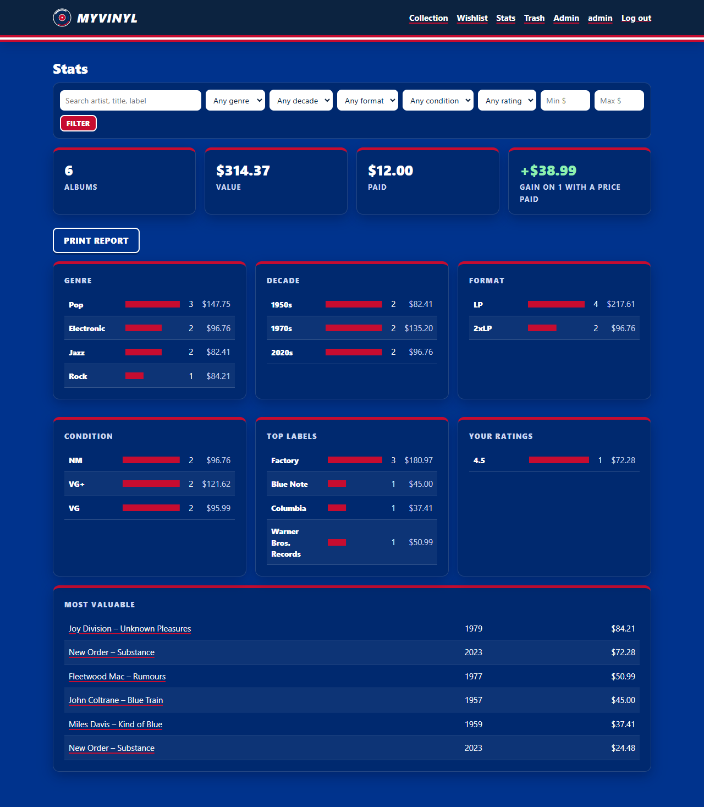 | 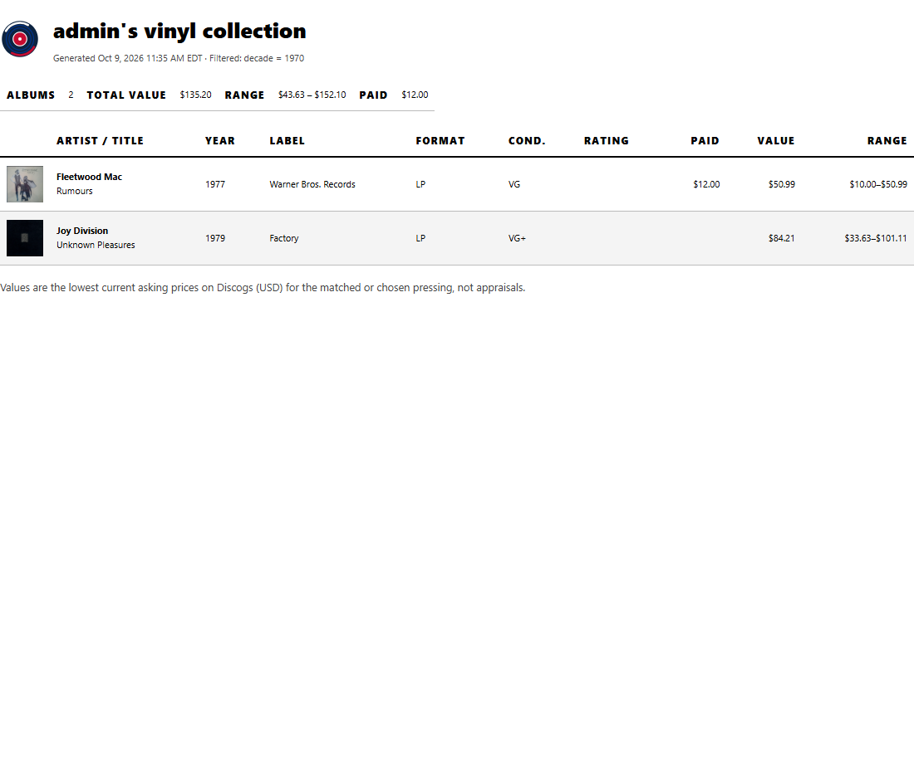 |

| Wishlist | Admin |
|---|---|
| 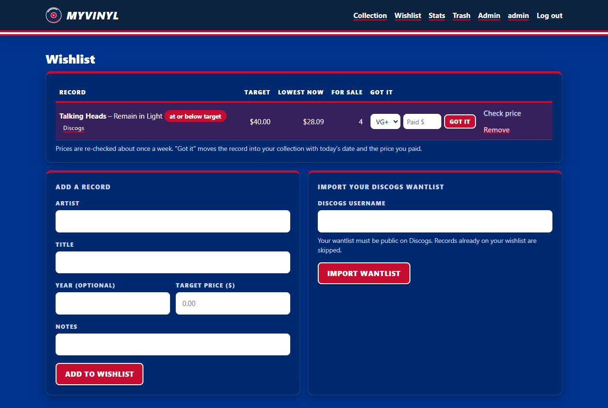 | 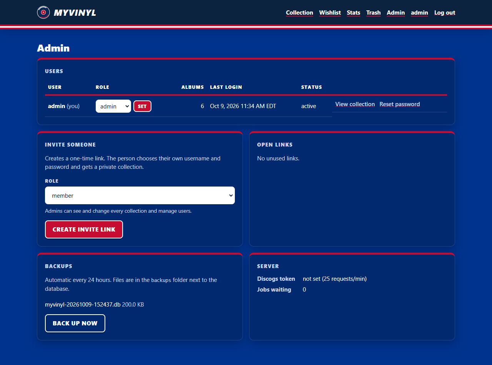 |

| Add album | Profile and themes | Log in | Phone |
|---|---|---|---|
| 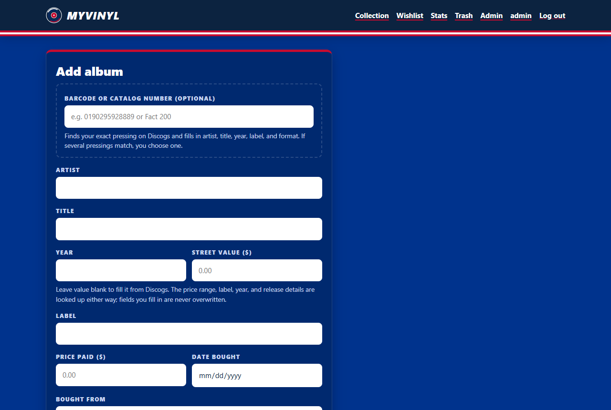 | 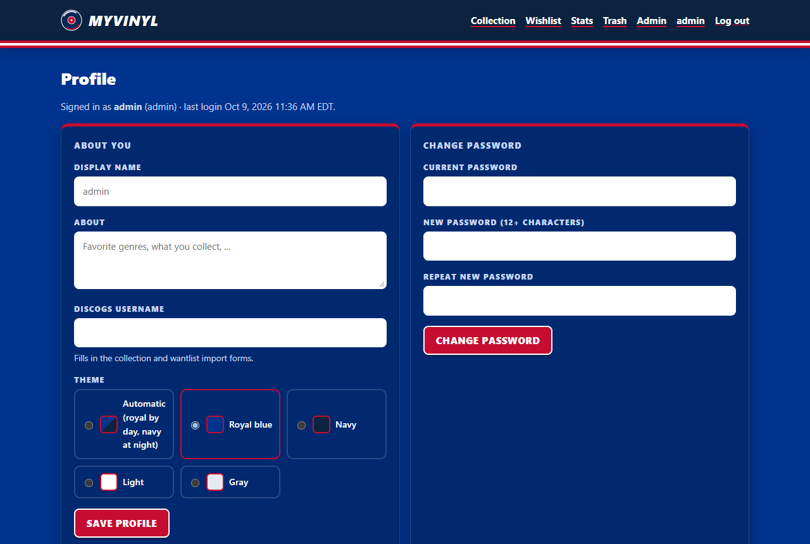 | 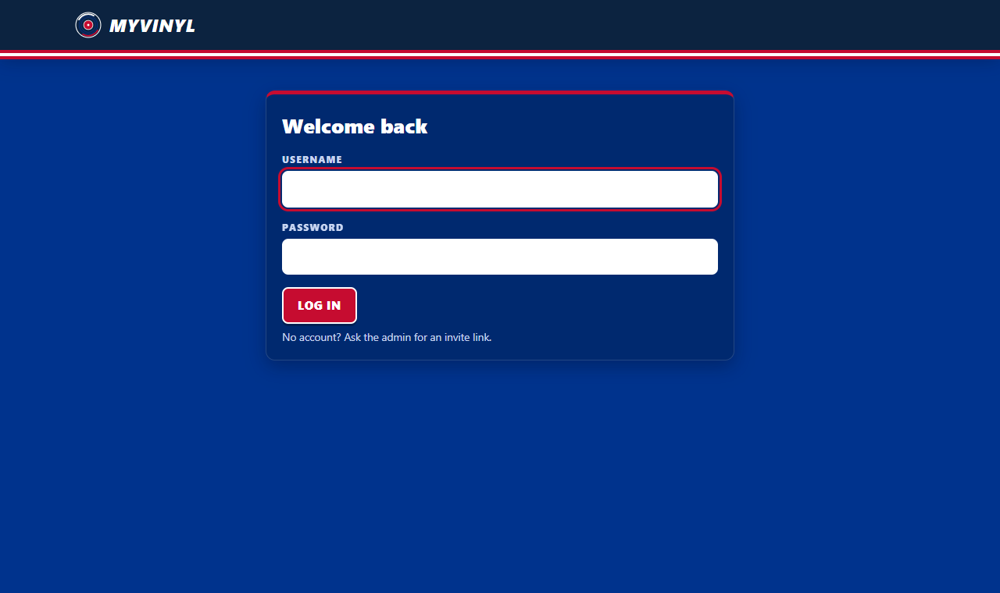 | 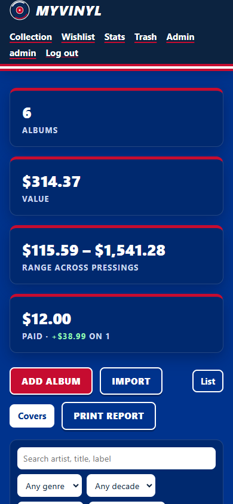 |

---

## Quick start

Requirements: Python 3.12 or newer and [uv](https://docs.astral.sh/uv/). To run it on a
server, see [Deploying online](#deploying-online).

```powershell
git clone https://github.com/johnzastrow/myvinyl.git
cd myvinyl
uv sync
uv run python -m myvinyl.credentials   # prompts for the admin password; prints two values
```

Set the printed values and start the server. In PowerShell, use single quotes, because
the password hash contains `$` characters:

```powershell
$env:MYVINYL_SECRET_KEY    = '<printed value>'
$env:MYVINYL_PASSWORD_HASH = '<printed value>'
$env:MYVINYL_DISCOGS_TOKEN = '<your token>'    # optional, see below
uv run myvinyl
```

On macOS or Linux, use `export NAME='value'` instead. Open <http://127.0.0.1:8000> and
log in as **admin** with the password you chose.

---

## Configuration

All settings are environment variables. The app **refuses to start** if a value is
malformed, rather than running with weak defaults.

| Variable | Default | Purpose |
|---|---|---|
| `MYVINYL_SECRET_KEY` | *(required)* | Signs session cookies. 32+ characters; `myvinyl.credentials` generates one. |
| `MYVINYL_PASSWORD_HASH` | *(first run)* | Argon2id hash for the first admin. Only used when the database has no accounts yet. |
| `MYVINYL_ADMIN_USER` | `admin` | Username for that first admin. |
| `MYVINYL_DISCOGS_TOKEN` | *(none)* | Shared Discogs personal token for the whole server: 60 requests/min instead of 25. |
| `MYVINYL_DB` | `myvinyl.db` | SQLite database path. Covers and backups are stored next to it. |
| `MYVINYL_BASE_URL` | *(from request)* | Public address for invite links, e.g. `https://myvinyl.fluidgrid.site`. |
| `MYVINYL_REFRESH_DAYS` | `7` | Re-check prices older than this many days (`0` = off). |
| `MYVINYL_BACKUP_HOURS` | `24` | Hours between automatic backups (`0` = off). |
| `MYVINYL_BACKUP_KEEP` | `14` | Number of backups kept. |
| `MYVINYL_TRASH_DAYS` | `30` | Days before trashed albums are deleted for good (`0` = never). |

Keep secrets out of version control: `.gitignore` excludes `.env` files, databases, covers,
and backups.

---

## Getting a Discogs token

myvinyl works without a token. With one, the Discogs API allows 60 requests per minute
instead of 25, so lookups finish about twice as fast: about 12 seconds per album instead of
about 30. **One token serves the whole server.** Users don't need their own.

1. **Create a free Discogs account** at <https://www.discogs.com/users/create>, or log in.
2. **Open the developer settings:** avatar (top right) → **Settings** → **Developers**,
   or go directly to <https://www.discogs.com/settings/developers>.
3. **Click "Generate new token"** and copy the long string of letters and numbers.
4. **Set it as `MYVINYL_DISCOGS_TOKEN`** and restart myvinyl. The admin page shows whether
   a token is configured.

Notes:

- **Treat the token like a password.** It is tied to your Discogs account. myvinyl only
  sends it to `api.discogs.com` in the `Authorization` header, and never logs or displays it.
- **To revoke it,** generate a new token on the same page; that invalidates the old one.
- **Importing someone's collection or wantlist** needs only their Discogs username, as long
  as their collection is public (Discogs → Settings → Privacy). The token owner's own
  collection works even when private.
- Use of the API is governed by the
  [Discogs API Terms of Use](https://support.discogs.com/hc/en-us/articles/360009334593-API-Terms-of-Use);
  see also the [Discogs API documentation](https://www.discogs.com/developers).

---

## Accounts and admins

- On first start, myvinyl creates the admin account from `MYVINYL_PASSWORD_HASH`. Albums
  from a pre-multi-user database are given to that admin.
- **Invite someone:** Admin → choose a role → **Create invite link** → send the link
  privately. It works once and expires after 7 days. The person picks their own username
  and password (12+ characters).
- **Roles:** *member* (their own collection) and *admin* (everything: all collections,
  users, invites, backups). The last active admin can't be disabled or demoted.
- **Viewing another collection:** Admin → **View collection**. A red banner shows whose
  collection you're in. Anything you add or import goes into that collection. Click
  **Back to mine** to leave.
- **Forgotten password:** an admin clicks **Reset password** to create a one-time reset
  link. Using it signs the user out everywhere.
- **Disable** blocks sign-in and ends the user's sessions immediately; their data is kept.
- **Profile:** display name, about text, Discogs username, theme, password change, and
  **Sign out everywhere**.

---

## How valuation works

1. **Search.** Discogs is queried for vinyl releases with the artist and title as separate
   fields (free-text search returns unrelated records). Results whose title doesn't contain
   your album title are dropped.
2. **Rank.** Official pressings come before unofficial ones, then pressings closest to the
   year you entered.
3. **Price.** The marketplace statistics for the top 10 pressings give each one's lowest
   current asking price (USD) and the number of copies for sale.
4. **Choose.** The pressing you picked with **Mine**, a barcode, or an import, or else the
   top-ranked one, is the match. Its full release record and images are saved, and the
   displayed cover is downloaded.
5. **Record:**

| Stored | Meaning |
|---|---|
| **Value** | The matched pressing's lowest asking price, or the range median if it has none for sale. A value you typed is never replaced. |
| **Range** | Low, median, and high asking prices across the pressings checked. |
| **History** | One point per lookup, charted on the album page. |
| **Pressings** | Each pressing checked, with year, country, label, catalog number, format, copies for sale, and price. |

An **asking price** is what sellers want today, for a copy in any condition. It isn't a
sale price or an appraisal.

---

## Using the app

| Task | How |
|---|---|
| Add an album | **Add album**. Type a barcode or catalog number for an exact match, or enter artist and title. Leave value blank to have it looked up. |
| Import from Discogs | **Import** → your Discogs username → default condition → **Import collection**. |
| Fix the pressing | Album page → **Mine** on your row of **Pressings checked**. |
| Record what you paid | **Edit** → price paid, date bought, bought from. |
| Add a dated note | Album page → **Notes** → **Add note**. |
| Rate and review | Album page → **Your rating and review**; **Rate tracks** above the tracklist. |
| Change the cover | Album page → click an image under **Album art**. |
| Filter | Use the filter bar on the collection or stats page; **Clear** resets it. |
| Print a report | **Print report** (follows the current filters) → your browser's Print (Ctrl+P). |
| Wishlist | **Wishlist** → add records or import your Discogs wantlist → **Got it** when you buy one. |
| Delete / restore | **Edit** → **Move this album to the trash**; **Trash** → **Restore** or **Delete forever**. |
| Change theme | Click your name (top right) → **Theme** → **Save profile**. |

---

## Security

myvinyl is built to run on the public internet. The full review, with findings and
residual risks, is in **[SECURITY.md](SECURITY.md)**. Highlights:

| Area | Protection |
|---|---|
| Passwords | Argon2id, 12+ characters, hashed off the request thread with limited concurrency. |
| Login | Per-IP and per-username rate limits; the same error for wrong user or password; no timing difference. |
| Sessions | Signed `HttpOnly`, `Secure`, `SameSite=Lax` cookies, 12-hour lifetime, revoked on password change, reset, disable, or **Sign out everywhere**. |
| Authorization | Owner-or-admin check on every record; others get 404. |
| Invites and resets | 256-bit one-time tokens, stored only as SHA-256 hashes, expire in 7 days, redacted from logs. |
| CSRF | Per-session token on every form that changes data. |
| Injection and XSS | Parameterized SQL with allowlisted sort and filter clauses; auto-escaped templates; CSP with no scripts. |
| Outbound requests | Fixed Discogs hosts only; images must be the release's own `i.discogs.com` URLs; no redirects; type and size checked. |
| Container | Non-root, read-only filesystem, no capabilities, bound to `127.0.0.1` behind Caddy. |

---

## Deploying online

Production setup for **https://myvinyl.fluidgrid.site** (Docker behind the host's Caddy)
is described step by step in **[deploy/DEPLOY.md](deploy/DEPLOY.md)**:

1. Add a DNS record for `myvinyl.fluidgrid.site`.
2. `cp deploy/env.template .env`, then generate the secrets with
   `docker compose run --rm myvinyl python -m myvinyl.credentials`.
3. `docker compose up -d --build` (the app listens on `127.0.0.1:8085`).
4. Append `deploy/Caddyfile.myvinyl` to the host Caddyfile and reload Caddy.

---

## Backups and data

- Everything lives next to `MYVINYL_DB`: the database, `covers/`, and `backups/`.
- Automatic backups use SQLite's online backup API, so they're consistent while the app
  runs. **Admin → Back up now** makes one on demand.
- Copy backups off the server regularly; see `deploy/DEPLOY.md`.
- **Export CSV** gives a spreadsheet copy of any (filtered) view.
- New versions upgrade the database automatically on startup without deleting anything.

---

## Development

```powershell
uv sync                                        # install, including dev tools
uv run pytest                                  # 79 tests; Discogs is faked, no network
uv run ruff check --fix . ; uv run ruff format .
```

`create_app(settings, service=..., inline_jobs=True)` accepts a fake Discogs service and
runs background jobs inline, so tests never touch the network or start threads.

---

## Project layout

```
myvinyl/
├── src/myvinyl/
│   ├── main.py          # Routes, access control, CSRF, background jobs, admin
│   ├── db.py            # SQLite schema, migrations, owner-scoped queries, filters, stats
│   ├── discogs.py       # Discogs client, matching, pricing, imports, image download
│   ├── albums.py        # Field validation for albums, wishlist, accounts, profiles
│   ├── auth.py          # Argon2id, one-time link tokens, login rate limiter
│   ├── lookups.py       # Background job queue and periodic tasks
│   ├── storage.py       # Saved covers and SQLite backups
│   ├── charts.py        # Server-side SVG geometry for the value-history chart
│   ├── config.py        # Environment settings (fail closed)
│   ├── credentials.py   # Admin password hash and secret key generator
│   ├── __main__.py      # `uv run myvinyl` entry point (log redaction, uvicorn)
│   ├── templates/       # Jinja2 pages
│   └── static/          # style.css (themes), logo, favicons
├── tests/               # pytest suite
├── deploy/              # DEPLOY.md, Caddy site block, env template
├── docs/screenshots/    # Images used in this README
├── Dockerfile, compose.yaml
├── SECURITY.md, CHANGELOG.md, TODO.md
└── pyproject.toml, uv.lock
```

---

## Changelog

The full history is in [CHANGELOG.md](CHANGELOG.md).

### 0.6.0 - 2026-10-09
- **Added:** multiple users with private collections, admin role, invite and reset links,
  profiles, and five themes (Royal, Navy, Light, Gray, Automatic); trash with restore
  and automatic purge; purchase price, date, and seller with gain and loss; dated notes;
  wishlist with price checks, Discogs wantlist import, and "Got it"; cover grid view;
  filters; stats page; printed reports; locally saved covers; automatic backups; Docker
  and Caddy deployment.
- **Security:** full review (SECURITY.md); password hashing moved off the event loop;
  "Sign out everywhere"; no redirects on image downloads; tokens redacted from logs.

### 0.5.0 - 2026-10-09
- Pick your pressing; add by barcode or catalog number; Discogs collection import; value
  history with weekly refresh; album and track ratings and reviews.

### 0.4.0 - 2026-10-09
- Value range across pressings, Discogs metadata, album art chooser, optional token,
  stronger theme, Eastern time, logo and favicon.

### 0.3.0 - 2026-10-09
- Automatic street value from Discogs.

### 0.2.0 - 2026-10-09
- Buffalo Bills color theme.

### 0.1.0 - 2026-10-09
- First release: albums, search, sort, totals, CSV export, secure login.

---

<sub>myvinyl is a personal project and is not affiliated with Discogs or the Buffalo Bills.
Album data and images come from <a href="https://www.discogs.com">Discogs</a>.</sub>
